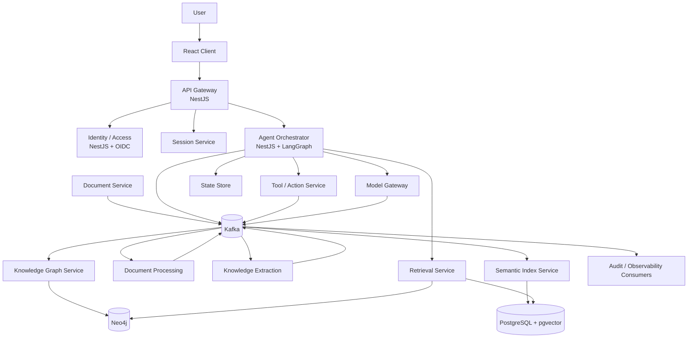

# 02 — Platform Architecture

## 1. Logical architecture



## 2. End-to-end request flow

```text
User
  -> React
  -> API Gateway
  -> Identity verification
  -> Session lookup/creation
  -> Agent task creation
  -> Agent Orchestrator
  -> Query understanding
  -> Retrieval Planner
  -> Hybrid Retrieval
  -> Context/Evidence Builder
  -> LLM
  -> Action planning when required
  -> Tool/Model execution through policy boundary
  -> Result collection
  -> State update
  -> Response
```

## 3. Event-driven ingestion flow

```text
Document Service
    |
    | document.uploaded
    v
Kafka
    |
    v
Document Processing
    |
    | document.processing.completed
    v
Kafka
    |
    v
Knowledge Extraction
    |
    +--------------------------+
    |                          |
    v                          v
Knowledge Graph Service   Semantic Index Service
    |                          |
    v                          v
 Neo4j                     pgvector
    \                          /
     \                        /
      +---- Retrieval -------+
```

## 4. Synchronous vs asynchronous

Use synchronous APIs when the caller needs an immediate result and the operation is short-lived:

- authentication/token exchange;
- simple metadata queries;
- health checks;
- retrieval queries where latency is expected to be interactive;
- read APIs.

Use Kafka events for long-running or independently scalable work:

- document processing;
- extraction;
- indexing;
- asynchronous agent tasks;
- audit/analytics fan-out;
- background enrichment.

The architecture must avoid the false rule that "everything goes through Kafka." Kafka is a backbone, not a replacement for every HTTP or internal call.

## 5. Deployment boundary

Every application under `apps/` must be independently buildable and containerizable. A service can initially be deployed as one Kubernetes Deployment with multiple replicas and later scale independently.
