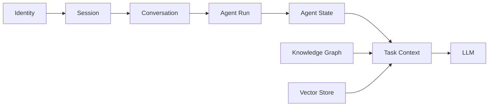

# 05 — Session and State

## State separation

RKGB uses explicit separation between:

1. **Identity** — who is acting.
2. **Session** — the user's interaction session.
3. **Conversation** — the conversational thread.
4. **Agent Run** — one execution of an agent graph.
5. **Agent State** — mutable execution state for that run.
6. **Context** — the task-specific evidence presented to the model.
7. **Knowledge** — durable domain knowledge stored in graph/vector systems.

## Persistence

PostgreSQL is the default durable relational store. Redis may be used for ephemeral/cache state. LangGraph checkpoints should be persisted so runs can resume after worker failure.

## State ownership

The session service owns session/conversation metadata. The agent orchestrator owns execution state. The knowledge services own research knowledge. No service should create a shadow copy of another service's authoritative state unless it is explicitly a read projection.

## Concurrency

The platform must support:

- many users;
- many conversations per user;
- many agent runs per conversation;
- independent runs executing concurrently;
- resumable runs;
- retries without accidental duplicate side effects.

Every run receives a unique `runId` and every asynchronous task receives a unique `taskId`/`eventId`.
