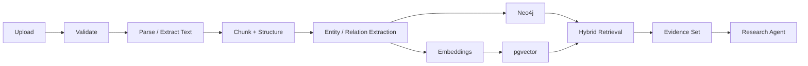

# 09 — Research Knowledge Pipeline

## V1 objective

Transform research documents into a provenance-aware hybrid knowledge base that can answer research questions using graph relationships and semantic evidence.

## Pipeline



## Domain entities

Initial entities include:

- Document
- Section
- Chunk
- Author
- Institution
- Researcher
- Algorithm
- Method
- Dataset
- Experiment
- Finding
- Keyword
- Citation
- Research Topic

## Provenance

Every extracted entity or relationship should retain provenance to the source document/chunk where possible. This is essential for trustworthy research assistance.

Minimum provenance fields:

```text
documentId
chunkId
pageNumber (when available)
sourceTextHash
extractionMethod
confidence
extractedAt
```

## Processing strategy

Heavy processing is asynchronous. The API should acknowledge an ingestion task quickly and allow clients to observe task progress.

```text
POST /documents -> 202 Accepted
                  |
                  v
              taskId
                  |
                  v
              Kafka pipeline
```
